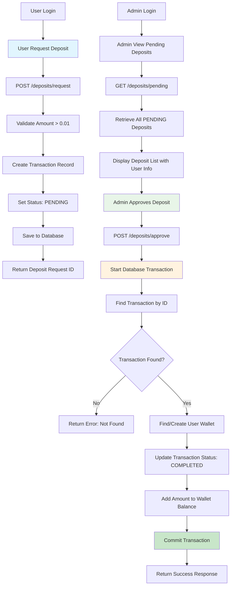
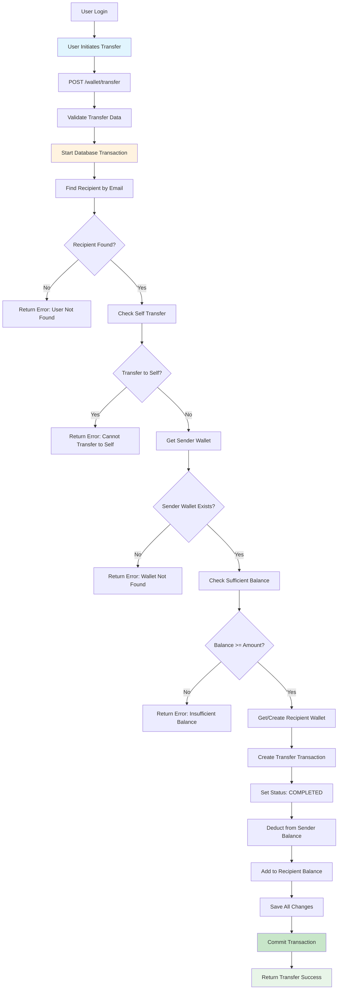
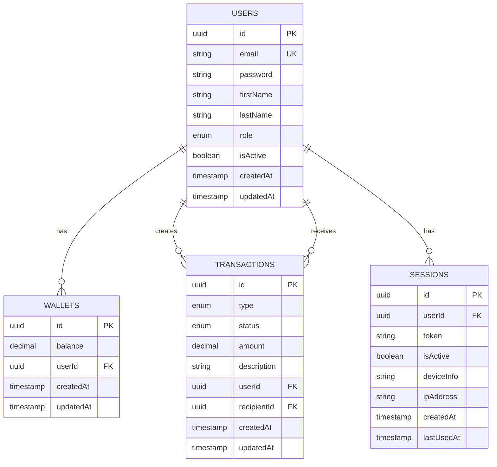
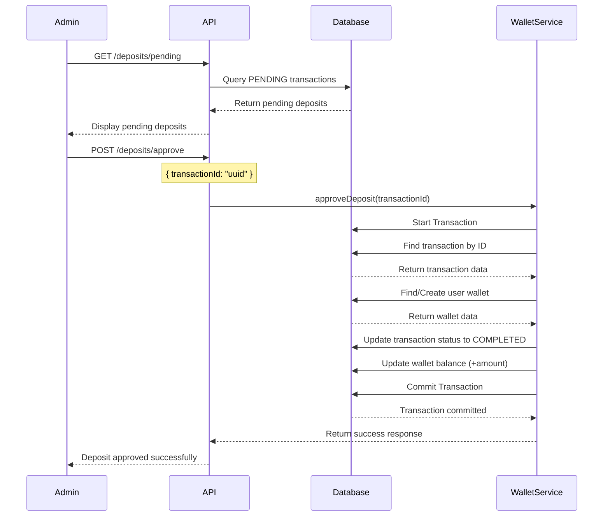

# E-Wallet API

A secure multi-user digital wallet API built with NestJS and MySQL. This comprehensive system supports user registration, authentication, deposits, transfers, and payments with role-based access control and session management.

## 🚀 Features

### System Design

#### Flowchart Diagrams

**a. User Deposit Request & Admin Approval Flow**



**b. User-to-User Transfer Flow**



#### ER Diagram

Database schema design for users, roles, wallets, and stateful transactions:



#### Sequence Diagram

**Deposit Approval Process** - UML Sequence Diagram showing interactions between Admin, API, and Database:



### User & Admin Management

✅ **User Registration**
- Endpoint: `POST /users/register`
- Password securely hashed using bcryptjs
- Automatic wallet creation for new users

✅ **Admin Seeding**
- Automatic admin user creation on application startup
- Default admin credentials: `admin@ewallet.com` / `admin123`

✅ **Role-Based JWTs**
- JWT tokens contain user ID and role (USER/ADMIN)
- Secure token generation and validation

✅ **Endpoint Protection**
- Role-based middleware for protecting endpoints
- Some endpoints accessible only by USER role
- Some endpoints accessible only by ADMIN role

✅ **HTTP Status Codes**
- Proper HTTP status codes for all responses
- 201 for successful creation
- 401 for unauthorized access
- 403 for forbidden access
- 409 for conflicts

### Login & Session Management

✅ **Login API**
- Endpoint: `POST /auth/login`
- Accepts user credentials and returns role-based JWT
- Device and IP tracking for session management

✅ **Success Response**
- Returns user data (excluding password) and generated token
- Proper response structure with user information

✅ **Error Response**
- Appropriate error messages for failed login attempts
- Proper HTTP status codes (401 for invalid credentials)

✅ **Single Sign-On (SSO)**
- Single-session policy implementation
- New login invalidates previous sessions
- Session tracking and management
- Logout functionality for current and all sessions

### Deposit Workflow

✅ **User: Request Deposit**
- Endpoint: `POST /deposits/request`
- USER-protected endpoint for deposit requests
- Creates transaction record with PENDING status
- Does NOT immediately update wallet balance

✅ **Admin: List Pending Deposits**
- Endpoint: `GET /deposits/pending`
- ADMIN-protected endpoint to list all pending deposits
- Returns detailed deposit information with user data

✅ **Admin: Approve Deposit**
- Endpoint: `POST /deposits/approve`
- ADMIN-protected endpoint to approve deposits
- Atomic operation: updates transaction status AND wallet balance
- Uses database transactions to ensure data integrity

### Wallet Transactions

✅ **User: Transfer to Other User**
- Endpoint: `POST /wallet/transfer`
- USER-protected endpoint for user-to-user transfers
- Atomic operation: debits sender and credits receiver
- Safe from concurrency issues (race conditions)
- Prevents self-transfers and validates sufficient balance

✅ **User: Pay with Balance**
- Endpoint: `POST /wallet/pay`
- USER-protected endpoint for payments
- Atomic operation: debits user's balance
- Validates sufficient balance before processing

✅ **User: Check Balance**
- Endpoint: `GET /wallet/balance`
- USER-protected endpoint to check current balance
- Endpoint: `GET /wallet/transactions`
- View complete transaction history

## 🛠 Technology Stack

- **Language:** TypeScript
- **Framework:** NestJS
- **Database:** MySQL
- **Authentication:** JWT
- **Password Hashing:** bcryptjs
- **Validation:** class-validator
- **ORM:** TypeORM
- **Containerization:** Docker & Docker Compose

## 📋 Prerequisites

- Node.js (v16 or higher)
- Docker and Docker Compose
- npm or yarn

## 🚀 Getting Started

### Option 1: Using Docker (Recommended)

1. **Clone the repository**
2. **Start the database services:**
   ```bash
   npm run docker:db
   ```
   This will start MySQL and phpMyAdmin.

3. **Install dependencies:**
   ```bash
   npm install
   ```

4. **Run the application:**
   ```bash
   npm run start:dev
   ```

### Option 2: Local MySQL

1. **Clone the repository**
2. **Install dependencies:**
   ```bash
   npm install
   ```

3. **Set up environment variables:**
   ```bash
   cp .env.example .env
   ```
   Update the `.env` file with your database credentials.

4. **Start MySQL and create the database:**
   ```sql
   CREATE DATABASE ewallet_db;
   ```

5. **Run the application:**
   ```bash
   npm run start:dev
   ```

## 🐳 Docker Services

- **MySQL**: `localhost:3308`
- **phpMyAdmin**: `http://localhost:8080`
- **API**: `http://localhost:3001` (or 3000 if available)

### Database Credentials
- **Host:** `localhost`
- **Port:** `3308`
- **Database:** `ewallet_db`
- **Username:** `root`
- **Password:** `password`

### phpMyAdmin Access
- **URL:** `http://localhost:8080`
- **Username:** `root`
- **Password:** `password`

The application will start and automatically create the admin user.

## 📚 API Documentation

### Base URL
```
http://localhost:3001
```

### Authentication
The API uses JWT (JSON Web Token) authentication. Include the token in the Authorization header:

```
Authorization: Bearer <your-jwt-token>
```

### Response Format

#### Success Response
```json
{
  "message": "Success message",
  "data": { ... }
}
```

#### Error Response
```json
{
  "statusCode": 400,
  "message": "Error message",
  "error": "Bad Request"
}
```

### HTTP Status Codes
- `200` - OK
- `201` - Created
- `400` - Bad Request
- `401` - Unauthorized
- `403` - Forbidden
- `404` - Not Found
- `409` - Conflict
- `500` - Internal Server Error

## 🔐 Authentication Endpoints

### Register User
```http
POST /users/register
Content-Type: application/json

{
  "email": "user@example.com",
  "password": "password123",
  "firstName": "John",
  "lastName": "Doe"
}
```

**Response:**
```json
{
  "message": "User registered successfully",
  "user": {
    "id": "uuid",
    "email": "user@example.com",
    "firstName": "John",
    "lastName": "Doe",
    "role": "USER"
  }
}
```

### Login
```http
POST /auth/login
Content-Type: application/json

{
  "email": "user@example.com",
  "password": "password123"
}
```

**Response:**
```json
{
  "user": {
    "id": "uuid",
    "email": "user@example.com",
    "firstName": "John",
    "lastName": "Doe",
    "role": "USER"
  },
  "token": "jwt-token"
}
```

### Logout
```http
POST /auth/logout
Authorization: Bearer <jwt-token>
```

**Response:**
```json
{
  "message": "Logged out successfully"
}
```

### Logout All Sessions
```http
POST /auth/logout-all
Authorization: Bearer <jwt-token>
```

**Response:**
```json
{
  "message": "All sessions logged out successfully"
}
```

### Get Active Sessions
```http
GET /auth/sessions
Authorization: Bearer <jwt-token>
```

**Response:**
```json
{
  "message": "Active sessions retrieved successfully",
  "sessions": [
    {
      "id": "session-uuid",
      "deviceInfo": "Mozilla/5.0...",
      "ipAddress": "192.168.1.1",
      "lastUsedAt": "2024-01-01T12:00:00Z",
      "createdAt": "2024-01-01T10:00:00Z"
    }
  ]
}
```

## 👤 User Management

### Get User Profile
```http
GET /users/profile
Authorization: Bearer <user-token>
```

**Response:**
```json
{
  "message": "Profile retrieved successfully",
  "user": {
    "id": "uuid",
    "email": "user@example.com",
    "firstName": "John",
    "lastName": "Doe",
    "role": "USER",
    "isActive": true,
    "createdAt": "2024-01-01T10:00:00Z"
  }
}
```

### Update User Profile
```http
PUT /users/profile
Authorization: Bearer <user-token>
Content-Type: application/json

{
  "firstName": "John Updated",
  "lastName": "Doe Updated"
}
```

**Response:**
```json
{
  "message": "Profile updated successfully",
  "user": {
    "id": "uuid",
    "email": "user@example.com",
    "firstName": "John Updated",
    "lastName": "Doe Updated",
    "role": "USER"
  }
}
```

### Get All Users (Admin Only)
```http
GET /users
Authorization: Bearer <admin-jwt-token>
```

**Response:**
```json
{
  "message": "Users retrieved successfully",
  "users": [
    {
      "id": "uuid",
      "email": "user@example.com",
      "firstName": "John",
      "lastName": "Doe",
      "role": "USER",
      "isActive": true,
      "createdAt": "2024-01-01T10:00:00Z"
    }
  ]
}
```

### Create Admin (Admin Only)
```http
POST /auth/create-admin
Authorization: Bearer <admin-jwt-token>
Content-Type: application/json

{
  "email": "newadmin@example.com",
  "password": "admin123",
  "firstName": "Admin",
  "lastName": "User"
}
```

**Response:**
```json
{
  "message": "Admin created successfully"
}
```

## 💰 Deposit Management

### Create Deposit Request (User Only)
```http
POST /deposits/request
Authorization: Bearer <user-jwt-token>
Content-Type: application/json

{
  "amount": 100.50,
  "description": "Initial deposit"
}
```

**Response:**
```json
{
  "message": "Deposit request created successfully",
  "deposit": {
    "id": "transaction-uuid",
    "amount": 100.50,
    "description": "Initial deposit",
    "status": "PENDING",
    "createdAt": "2024-01-01T12:00:00Z"
  }
}
```

### Get Pending Deposits (Admin Only)
```http
GET /deposits/pending
Authorization: Bearer <admin-jwt-token>
```

**Response:**
```json
{
  "message": "Pending deposits retrieved successfully",
  "deposits": [
    {
      "id": "transaction-uuid",
      "amount": 100.50,
      "description": "Initial deposit",
      "userId": "user-uuid",
      "user": {
        "id": "user-uuid",
        "email": "user@example.com",
        "firstName": "John",
        "lastName": "Doe"
      },
      "createdAt": "2024-01-01T12:00:00Z"
    }
  ]
}
```

### Approve Deposit (Admin Only)
```http
POST /deposits/approve
Authorization: Bearer <admin-jwt-token>
Content-Type: application/json

{
  "depositId": "transaction-uuid"
}
```

**Response:**
```json
{
  "message": "Deposit approved successfully",
  "deposit": {
    "id": "transaction-uuid",
    "amount": 100.50,
    "status": "COMPLETED"
  },
  "newBalance": 100.50
}
```

### Get User Deposits (User Only)
```http
GET /deposits/my-deposits
Authorization: Bearer <user-jwt-token>
```

**Response:**
```json
{
  "message": "User deposits retrieved successfully",
  "deposits": [
    {
      "id": "transaction-uuid",
      "amount": 100.50,
      "description": "Initial deposit",
      "status": "COMPLETED",
      "createdAt": "2024-01-01T12:00:00Z"
    }
  ]
}
```

## 💳 Wallet Management

### Get Wallet Balance (User Only)
```http
GET /wallet/balance
Authorization: Bearer <user-jwt-token>
```

**Response:**
```json
{
  "message": "Balance retrieved successfully",
  "balance": {
    "balance": 100.50,
    "userId": "user-uuid",
    "user": {
      "id": "user-uuid",
      "email": "user@example.com",
      "firstName": "John",
      "lastName": "Doe"
    }
  }
}
```

### Transfer to Another User (User Only)
```http
POST /wallet/transfer
Authorization: Bearer <user-jwt-token>
Content-Type: application/json

{
  "recipientEmail": "recipient@example.com",
  "amount": 50.00,
  "description": "Payment for services"
}
```

**Response:**
```json
{
  "message": "Transfer completed successfully",
  "transaction": {
    "id": "transaction-uuid",
    "amount": 50.00,
    "type": "TRANSFER",
    "status": "COMPLETED",
    "newBalance": 50.50
  }
}
```

### Pay with Balance (User Only)
```http
POST /wallet/pay
Authorization: Bearer <user-jwt-token>
Content-Type: application/json

{
  "amount": 25.00,
  "description": "Purchase item"
}
```

**Response:**
```json
{
  "message": "Payment completed successfully",
  "transaction": {
    "id": "transaction-uuid",
    "amount": 25.00,
    "type": "PAYMENT",
    "status": "COMPLETED",
    "newBalance": 25.50
  }
}
```

### Get Transaction History (User Only)
```http
GET /wallet/transactions?page=1&limit=10
Authorization: Bearer <user-jwt-token>
```

**Response:**
```json
{
  "message": "Transaction history retrieved successfully",
  "transactions": [
    {
      "id": "transaction-uuid",
      "type": "TRANSFER",
      "status": "COMPLETED",
      "amount": 50.00,
      "description": "Payment for services",
      "recipientId": "recipient-uuid",
      "recipient": {
        "id": "recipient-uuid",
        "email": "recipient@example.com",
        "firstName": "Jane",
        "lastName": "Smith"
      },
      "createdAt": "2024-01-01T12:00:00Z",
      "updatedAt": "2024-01-01T12:00:00Z"
    }
  ],
  "pagination": {
    "page": 1,
    "limit": 10,
    "total": 1,
    "totalPages": 1
  }
}
```

## 🗄️ Database Schema

### Users Table
- `id` (UUID, Primary Key)
- `email` (String, Unique)
- `password` (String, Hashed)
- `firstName` (String)
- `lastName` (String)
- `role` (Enum: USER, ADMIN)
- `isActive` (Boolean)
- `createdAt` (Timestamp)
- `updatedAt` (Timestamp)

### Wallets Table
- `id` (UUID, Primary Key)
- `balance` (Decimal)
- `userId` (UUID, Foreign Key)
- `createdAt` (Timestamp)
- `updatedAt` (Timestamp)

### Transactions Table
- `id` (UUID, Primary Key)
- `type` (Enum: DEPOSIT, TRANSFER, PAYMENT)
- `status` (Enum: PENDING, COMPLETED, FAILED)
- `amount` (Decimal)
- `description` (String, Optional)
- `userId` (UUID, Foreign Key)
- `recipientId` (UUID, Foreign Key, Optional)
- `createdAt` (Timestamp)
- `updatedAt` (Timestamp)

### Sessions Table
- `id` (UUID, Primary Key)
- `userId` (UUID, Foreign Key)
- `token` (String)
- `isActive` (Boolean)
- `deviceInfo` (String, Optional)
- `ipAddress` (String, Optional)
- `createdAt` (Timestamp)
- `lastUsedAt` (Timestamp, Optional)

## 🔒 Security Features

1. **Password Hashing**: All passwords are hashed using bcryptjs
2. **JWT Authentication**: Secure token-based authentication
3. **Role-Based Access Control**: Different endpoints for USER and ADMIN roles
4. **Session Management**: Single Sign-On (SSO) with session tracking
5. **Input Validation**: All inputs are validated using class-validator
6. **SQL Injection Protection**: Using TypeORM with parameterized queries
7. **CORS**: Cross-Origin Resource Sharing enabled
8. **Atomic Transactions**: Database transactions ensure data integrity

## 🐳 Docker Commands

```bash
# Start database only
npm run docker:db

# Stop database
npm run docker:db:stop

# Start full application with Docker
npm run docker:up

# Stop all services
npm run docker:down

# Build application
npm run docker:build

# View logs
npm run docker:logs
```

## 🌍 Environment Variables

Required environment variables:
- `DB_HOST` - Database host
- `DB_PORT` - Database port
- `DB_USERNAME` - Database username
- `DB_PASSWORD` - Database password
- `DB_DATABASE` - Database name
- `JWT_SECRET` - JWT secret key
- `JWT_EXPIRES_IN` - JWT expiration time
- `PORT` - Application port
- `NODE_ENV` - Environment (development/production)

## 📋 Default Admin Credentials

- **Email:** admin@ewallet.com
- **Password:** admin123

## 🚀 Deployment

### Docker
Use the provided Docker Compose setup:
```bash
npm run docker:up
```

### Production Build
```bash
npm run build
npm run start:prod
```

## 🐛 Troubleshooting

### Common Issues

1. **Connection Refused:**
   - Make sure the application is running on the correct port
   - Check if the database is running

2. **401 Unauthorized:**
   - Make sure you're using a valid JWT token
   - Check if the token has expired
   - Verify the Authorization header format: `Bearer <token>`

3. **403 Forbidden:**
   - Check if you have the correct role for the endpoint
   - Admin endpoints require ADMIN role
   - User endpoints require USER role

4. **400 Bad Request:**
   - Check the request body format
   - Verify all required fields are provided
   - Check data validation rules

### Database Issues
- If you get database connection errors, make sure MySQL is running:
  ```bash
  npm run docker:db
  ```

### Port Conflicts
- If port 3000/3001 is in use, update the `base_url` environment variable
- If port 3308 (MySQL) is in use, check the docker-compose.yml file

## 📝 Error Handling

### Common Error Responses

#### Validation Error (400)
```json
{
  "statusCode": 400,
  "message": [
    "email must be an email",
    "password must be longer than or equal to 6 characters"
  ],
  "error": "Bad Request"
}
```

#### Unauthorized (401)
```json
{
  "statusCode": 401,
  "message": "Invalid credentials",
  "error": "Unauthorized"
}
```

#### Forbidden (403)
```json
{
  "statusCode": 403,
  "message": "Forbidden resource",
  "error": "Forbidden"
}
```

#### Not Found (404)
```json
{
  "statusCode": 404,
  "message": "User not found",
  "error": "Not Found"
}
```

#### Conflict (409)
```json
{
  "statusCode": 409,
  "message": "User with this email already exists",
  "error": "Conflict"
}
```

## 📊 Data Models

### User
```typescript
{
  id: string;           // UUID
  email: string;        // Unique email address
  password: string;     // Hashed password
  firstName: string;    // User's first name
  lastName: string;     // User's last name
  role: "USER" | "ADMIN"; // User role
  isActive: boolean;    // Account status
  createdAt: Date;      // Creation timestamp
  updatedAt: Date;      // Last update timestamp
}
```

### Wallet
```typescript
{
  id: string;           // UUID
  balance: number;      // Current balance (decimal)
  userId: string;       // Owner user ID
  createdAt: Date;      // Creation timestamp
  updatedAt: Date;      // Last update timestamp
}
```

### Transaction
```typescript
{
  id: string;                    // UUID
  type: "DEPOSIT" | "TRANSFER" | "PAYMENT"; // Transaction type
  status: "PENDING" | "COMPLETED" | "FAILED"; // Transaction status
  amount: number;                // Transaction amount (decimal)
  description?: string;          // Optional description
  userId: string;                // User who initiated transaction
  recipientId?: string;          // Recipient user ID (for transfers)
  createdAt: Date;               // Creation timestamp
  updatedAt: Date;               // Last update timestamp
}
```

### Session
```typescript
{
  id: string;           // UUID
  userId: string;       // User ID
  token: string;        // JWT token
  isActive: boolean;    // Session status
  deviceInfo?: string;  // Device information
  ipAddress?: string;   // IP address
  createdAt: Date;      // Creation timestamp
  lastUsedAt?: Date;    // Last activity timestamp
}
```

## 📈 Performance & Scalability

- **Atomic Transactions**: All financial operations use database transactions
- **Concurrency Safe**: Race condition protection for transfers and payments
- **Session Management**: Efficient session tracking and cleanup
- **Input Validation**: Comprehensive validation prevents invalid data
- **Error Handling**: Proper error responses with appropriate HTTP status codes

## 🔄 Development Workflow

1. **Start Database**: `npm run docker:db`
2. **Install Dependencies**: `npm install`
3. **Start Development**: `npm run start:dev`
4. **Lint Code**: `npm run lint`

## 📞 Support

For support and questions:
1. Check the application logs
2. Verify the database connection
3. Ensure all environment variables are set correctly
4. Check the API documentation for endpoint requirements
5. Review the troubleshooting section above

## 📄 License

This project is an E-Wallet API system built with NestJS, TypeScript, and MySQL.

---

**Built with ❤️ using NestJS, TypeScript, and MySQL**
